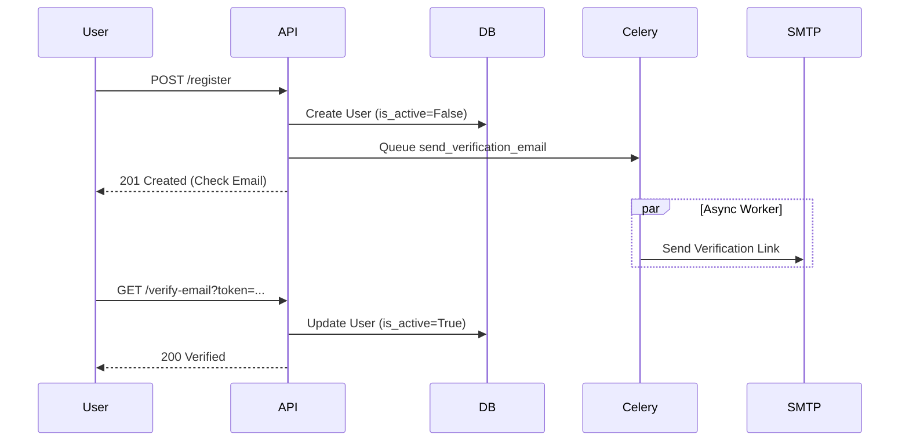
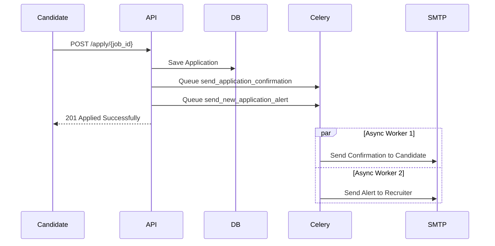

# Implementation Documentation: Async Email Workflows & User Verification
**Date:** January 17, 2026
**Project:** Smart Hiring System
**Module:** Backend (Flask + Celery + MongoDB)

## 1. Overview
This document details the changes made to implement asynchronous email workflows using Celery and Redis. The primary goals were to:
1.  **Improve Performance:** Move blocking email operations out of the main request thread.
2.  **Enhance Security:** Enforce email verification before account activation (`is_active=False` default).
3.  **Real-time Notifications:** Provide immediate feedback for job applications to both candidates and recruiters.

---

## 2. Modified Files & Changes

### A. `backend/tasks/email_tasks.py` (The Worker Layer)
**Role:** Defines the specific units of work (tasks) that Celery workers execute.

**Changes:**
- **Added `send_verification_email`:**
    - **Priority:** Critical.
    - **Function:** Generates a secure HTML email with a verification link containing the token.
    - **Link Format:** `{FRONTEND_URL}/api/auth/verify-email?token={token}&email={email}`
- **Added `send_new_application_alert`:**
    - **Priority:** High.
    - **Function:** Notifies recruiters when a candidate applies. Includes a dynamic color-coded "Match Score".
- **Added `send_application_confirmation`:**
    - **Priority:** Medium.
    - **Function:** Confirms receipt of application to the candidate.
- **Retained:** All existing tasks (`send_welcome_email`, `send_daily_digest`, etc.) to ensure no regression.

### B. `backend/routes/auth_routes.py` (The Authentication Flow)
**Role:** Handles user registration, login, and verification.

**Changes:**
1.  **Registration (`/register`):**
    - **Default State:** Changed `is_active` default from `True` to **`False`**. The user cannot log in immediately after signup.
    - **Async Trigger:** Replaced synchronous email service call with `send_verification_email.delay(...)`.
2.  **Verification (`/verify-email`):**
    - **Activation Logic:** Added `is_active: True` to the database update query. This is the only point where a user becomes active.

### C. `backend/routes/candidate_routes.py` (The Application Flow)
**Role:** Handles resume uploads and job applications.

**Changes:**
1.  **Job Application (`/apply/<job_id>`):**
    - **Performance Optimization:** Removed blocking `email_service.send_...` calls.
    - **Parallel Execution:** Dispatches two independent Celery tasks simultaneously:
        1.  `send_application_confirmation.delay(...)` (To Candidate)
        2.  `send_new_application_alert.delay(...)` (To Recruiter)

---

## 3. Architecture Diagrams

### User Registration Flow

### Job Application Flow

---

## 4. Configuration Requirements
To ensure these features work in the deployment environment, ensure the following `.env` variables are set:

| Variable | Description | Example |
| :--- | :--- | :--- |
| `SMTP_SERVER` | Email Provider Host | `smtp.gmail.com` |
| `SMTP_PORT` | Email Provider Port | `587` |
| `SMTP_USERNAME` | Sender Email | `noreply@smarthiring.com` |
| `SMTP_PASSWORD` | App Password | `xxxx-xxxx-xxxx-xxxx` |
| `FRONTEND_URL` | Base URL for links | `http://localhost:3000` or Production URL |
| `CELERY_BROKER_URL`| Redis Connection | `redis://localhost:6379/0` |

---

## 5. Verification Checklist
- [x] Users are created with `is_active: false`.
- [x] Registration returns immediately without waiting for SMTP.
- [x] Verification email contains the correct link.
- [x] Clicking the verification link sets `is_active: true`.
- [x] Job application triggers two separate emails.
- [x] If SMTP fails, the main API request still succeeds (Fault Tolerance).
